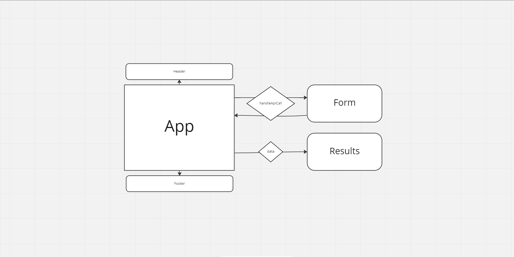
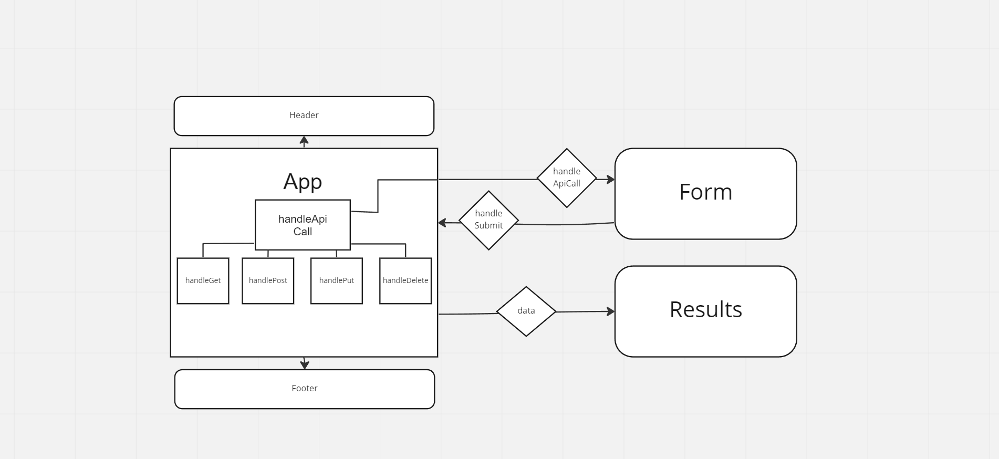

# RESTy

API test form that can run on any browser.

## Phase 1

Starter code from [Code Fellows Repo](https://github.com/codefellows/seattle-code-javascript-401d48/tree/main/class-26/lab/starter-code) was utilized and altered to create initial framework and style.

[Code Sandbox](https://codesandbox.io/p/github/HaydenCleaver/resty/dev?selection=%5B%7B%22endColumn%22%3A22%2C%22endLineNumber%22%3A3%2C%22startColumn%22%3A22%2C%22startLineNumber%22%3A3%7D%5D&file=%2FREADME.md)

### UML

## Phase 2

Altered App.js from a class to a function and implemented hooks within it and child components where necessary. Post and Get route functions were created within App.js and are called within `callApi` function.

[Code Sandbox](https://codesandbox.io/p/github/HaydenCleaver/resty/state?file=%2Fsrc%2Fapp.js)

### UML

## Phase 3

Application now uses axios requests to support real API interaction with state hooks.

## Phase 4

Refactored code to use reducer hooks in place of useEffect hooks. 
